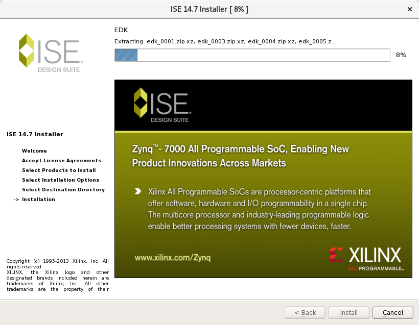
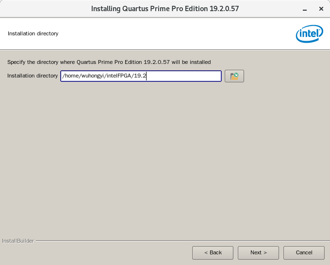
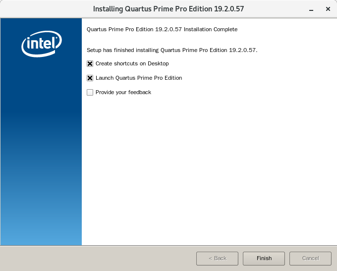
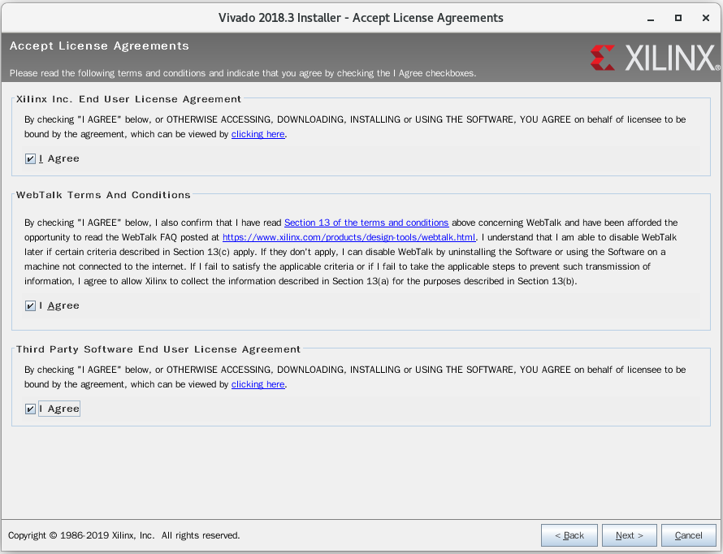
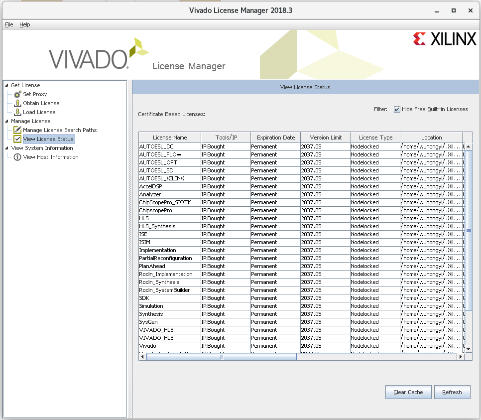

.. Install.rst --- 
.. 
.. Description: 
.. Author: Hongyi Wu(吴鸿毅)
.. Email: wuhongyi@qq.com 
.. Created: 六 8月 10 21:23:32 2019 (+0800)
.. Last-Updated: 六 8月 10 21:32:35 2019 (+0800)
..           By: Hongyi Wu(吴鸿毅)
..     Update #: 1
.. URL: http://wuhongyi.cn 

##################################################
软件安装
##################################################

============================================================
ISE 安装
============================================================

.. code-block:: bash
		
  tar -xvf Xilinx_ISE_DS_Lin_14.7_1015_1.tar 
  cd Xilinx_ISE_DS_Lin_14.7_1015_1
  ./xsetup

.. image:: img/ISE_install0.png
	   
.. image:: img/ISE_install1.png
	   
.. image:: img/ISE_install2.png
	   
.. image:: img/ISE_install3.png
	   
.. image:: img/ISE_install4.png
	   

	   
.. image:: img/ISE_install6.png
	   

  
  

============================================================
Altera 安装
============================================================

下载需要的所有文件，放在一个目录下

.. code-block:: text
		
  arria10-19.2.0.57.qdz                 ModelSimProSetup-19.2.0.57-linux.run
  cyclone10gx-19.2.0.57.qdz             QuartusProSetup-19.2.0.57-linux.run
  modelsim-part2-19.2.0.57-linux.qdz    stratix10-19.2.0.57.qdz

.. code-block:: bash

  chmod +x QuartusProSetup-19.2.0.57-linux.run
  ./QuartusProSetup-19.2.0.57-linux.run

.. image:: img/Quartus_install0.png
	   
.. image:: img/Quartus_install1.png
	   

	   
.. image:: img/Quartus_install3.png
	   
.. image:: img/Quartus_install4.png
	   

	   
.. image:: img/Quartus_install6.png

在安装路径下有以下文件

.. code-block:: bash

  devdata  licenses  modelsim_ase  qsys     syscon
  ip           logs        nios2eds         quartus  uninstall

quartus/bin 文件夹内存放quartus启动的脚本

.. code-block:: bash
		
  ./quartus

modelsim_ase/bin 文件夹内存放modelsim启动的脚本

.. code-block:: bash
		
  ./vsim 
  

  

============================================================
Vivado 安装
============================================================

.. code-block:: bash

  tar   -zxvf   Xilinx_Vivado_SDK_2018.3_1207_2324.tar.gz
  cd    Xilinx_Vivado_SDK_2018.3_1207_2324
  ./xsetup

.. image:: img/Vivado_install0.png

点击 continue选择不下载最新版本，然后点击Next进入下一步  

点击三个可选框，然后点击Next进入下一步  

.. image:: img/Vivado_install2.png

选择 Vinado HL Design Edition，然后点击Next进入下一步  

直接点击Next进入下一步  

.. image:: img/Vivado_install4.png

选择安装目录，这里我选择安装到 /home/wuhongyi/Xilinx ，然后点击Next进入下一步  

.. image:: img/Vivado_install5.png

等待安装完成

.. image:: img/Vivado_install6.png

将 vivadoLicence.lic 文件复制到 安装目录，这里为  /home/wuhongyi/Xilinx 

安装完成之后会弹出以下界面

.. image:: img/Vivado_install7.png

点击左上方的 Load License，选择我们的 vivadoLicence.lic 文件

然后点击左上方的 View License Status 可查看破解的IP核

  
		
   
.. 
.. Install.rst ends here
